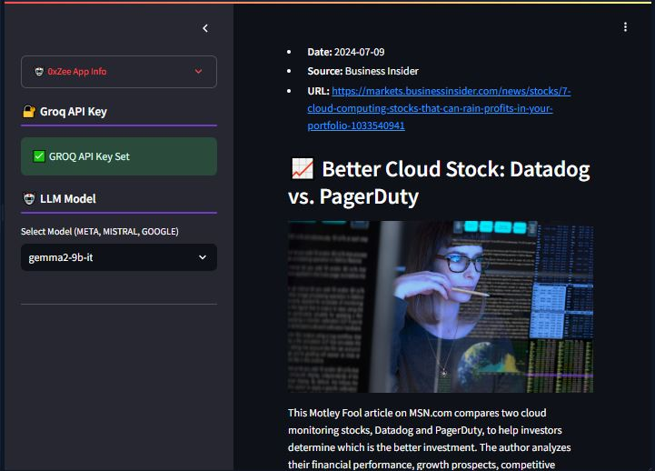

# 📝 `Weekly News Letter` Crew AI Agents 🖋️
### 🖋️ Streamlit App : NewsLetter Writer Crew AI Agents to Get `Last Weekly News` based on a specific `Topic`.
### 🤖 Pick your LLM : META's `llama3`, MISTRAL's `Mixtral`, GOOGLE's `Gemma` and `Gemma2` 

## NEWS LETTER : DuckDuckGo Search & CREW AI
- News Letter Writer assitant to help generate a LLM powered update Weekly News based on your topic.

## 📝 Streamlit Ai Crew :

- `CrewAi` : Framework for Agents, Tasks and Tools (2x2 Agents/Tasks)
- `Callbacks` : To render the Agents processing and final outputs
- `DuckSearchTools` : Get the last week informations from DuckDuckGo Search Class
- `Groq API` : for Inference
- `Available LLM` : META's `llama3`, MISTRAL's `Mixtral`, GOOGLE's `Gemma` and `Gemma2`.

## CREW AI AGENT :
- An advanced research assistant by leveraging LangChain-powered tools into a CrewAI-powered multi-agent setup.
- LangChain is a framework enabling developers to easily build LLM-powered applications over their data; it contains production modules for indexing, retrieval, and prompt/agent orchestration.
- A core use case is building a generalized QA interface enabling knowledge synthesis over complex questions.
- Plugging a LangChain RAG pipeline as a tool into a CrewAI agent setup enables even more sophisticated/advanced research flows

## ✈️ Run the App
- Fork or Clone the Repo
- Get and Put your `GROQ_API` in `.streamlit/secrets.toml`
- Run : `streamlit run blog_app.py`
